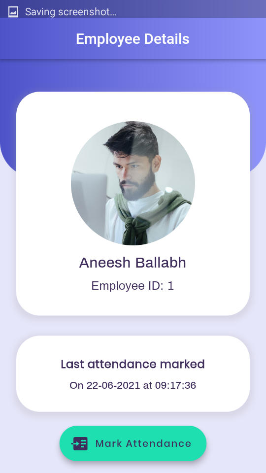
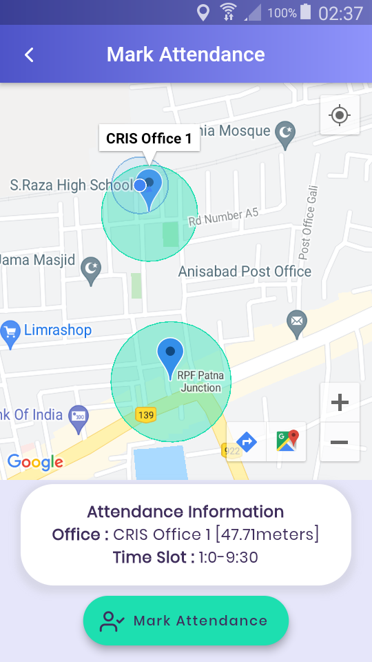
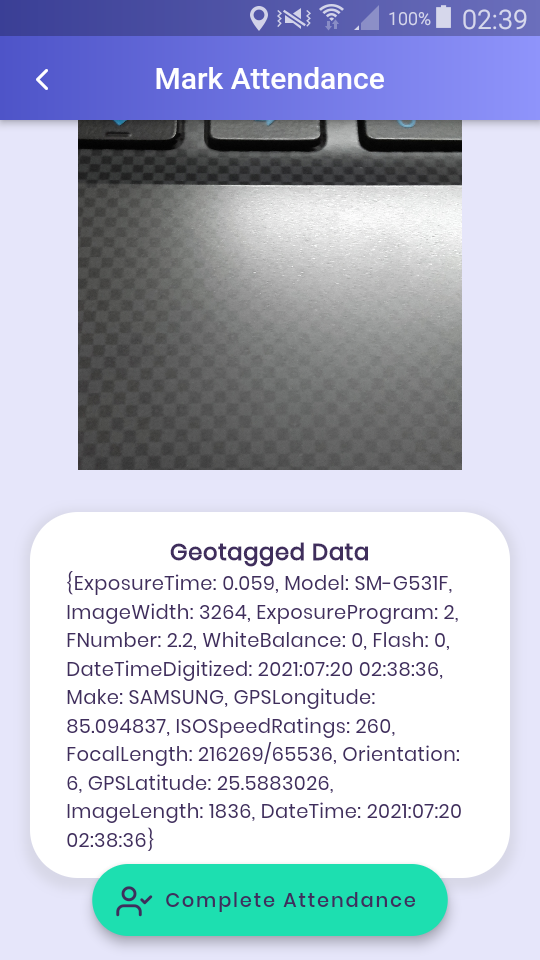

# Attendance Management System - CRIS

This is an Attendance Management System app built in flutter. It was developed during my internship at CENTRE FOR RAILWAY INFORMATION SYSTEMS (CRIS), the IT department of Indian Railways.

## Screenshots from the app

